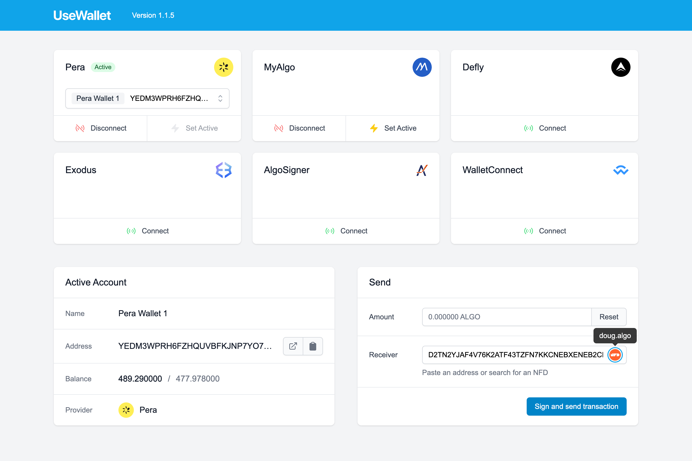

# next-use-wallet

This is an example project demonstrating [@txnlab/use-wallet](https://github.com/TxnLab/use-wallet) being used in a Next.js app. Connect your wallets with Pera, MyAlgo, Defly, Exodus, AlgoSigner, and WalletConnect. Send ALGO from your active wallet to any Algorand account or NFD.

Demo: [https://next-use-wallet.vercel.app/](https://next-use-wallet.vercel.app/)



## Local Development

First, clone the repository (or a fork)

```bash
git clone https://github.com/TxnLab/next-use-wallet.git
```

Install dependencies

```bash
cd next-use-wallet
yarn install
```

**Optional:** Edit the environment variables in `.env` or override with a `.env.local` file (Next.js docs: [Environment Variables](https://nextjs.org/docs/basic-features/environment-variables))

```bash
# Defined in .env (required)
NEXT_PUBLIC_NODE_NETWORK=mainnet
NEXT_PUBLIC_NODE_URL=https://mainnet-api.algonode.cloud

# Optional
NEXT_PUBLIC_NODE_TOKEN=
NEXT_PUBLIC_NODE_PORT=
```

Run the development server:

```bash
yarn dev
```

Open [http://localhost:3000](http://localhost:3000) with your browser to see the result.

## Learn More

The use-wallet library is an open source project built and maintained by TxnLab, Inc., with valued contributions by the Algorand development community. It was originally conceived as a robust multi wallet management solution for NFDomains.

- [use-wallet](https://github.com/TxnLab/use-wallet) - React hooks for using Algorand compatible wallets in dApps
- [NFDomains](https://app.nf.domains) - Algorand name service and marketplace for Non-Fungible Domains
- [NFD Documentation](https://docs.nf.domains) - learn about NFDs and the NFDomains platform
- [Algorand Developer Portal](https://developer.algorand.org/) - Algorand developer docs, SDKs, REST APIs, CLI tools, ecosystem projects, tutorials, and more

To learn more about Next.js, take a look at the following resources:

- [Next.js Documentation](https://nextjs.org/docs) - learn about Next.js features and API.
- [Learn Next.js](https://nextjs.org/learn) - an interactive Next.js tutorial.

## License

MIT
